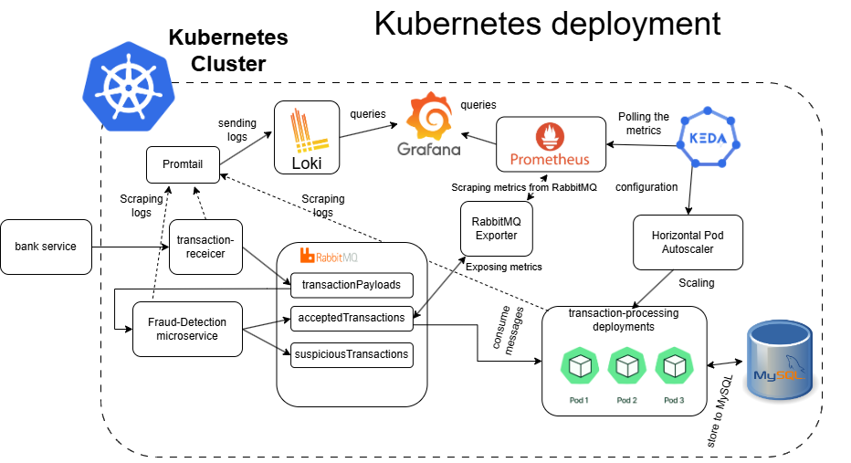

# Microservices Demo with RabbitMQ Message Broker


[Download the full architecture diagram (.drawio)](./documentation/microservices-scaling.drawio)

This project simulates a system for processing banking messages, similar to those used in financial institutions like Deutsche Börse. The architecture demonstrates how microservices communicate via RabbitMQ, process transactions, and integrate monitoring and scaling tools for a production-like environment.

---

## Requirements

- Docker Desktop (Windows/Mac) or Docker Engine (Linux)
- Kubernetes enabled in Docker Desktop, or a local cluster (e.g., minikube)
- Make
- Skaffold

---

## Prerequisites: Installing Make and Skaffold (Windows)

Before using the automated setup, ensure you have the following tools installed:

### Make (Windows)

- Install via Chocolatey:
  ```bash
  choco install make
  ```

### Skaffold (Windows)

- Install via Chocolatey:
  ```bash
  choco install skaffold
  ```

---

For Mac and Linux instructions, see:

- [Make documentation](https://www.gnu.org/software/make/)
- [Skaffold installation guide](https://skaffold.dev/docs/install/)

---

## Project Overview

A demo microservices system using Node.js, RabbitMQ, Docker, and Kubernetes. Includes monitoring, scaling, and automation tools.

## Quick Start (Recommended)

Use the automated Makefile and Skaffold setup for a robust, production-like environment.

### Start the stack

```bash
make up
```

Installs global dependencies and deploys all microservices and supporting resources via Skaffold.

### Stop the stack

```bash
make down
```

Cleans up microservices and global resources.

### Install dependencies only

```bash
make install-dependencies
```

Installs Grafana, KEDA, metrics-server, and other global services.

### Accessing Services

After deployment, you can access the following services:

| Service           | URL / Port             | Username | Password |
| ----------------- | ---------------------- | -------- | -------- |
| Grafana           | http://localhost:30001 | admin    | admin    |
| Prometheus        | http://localhost:9090  | -        | -        |
| RabbitMQ          | http://localhost:30008 | guest    | guest    |
| RabbitMQ Exporter | http://localhost:9419  | -        | -        |
| MySQL             | (via MySQL Workbench)  | root     | root     |

> Note: If you use port-forwarding, ensure the relevant commands are running (see Quick Start and Extra Info sections).

---

## Setup Options

### 1. Docker Compose

Simple local development and manual scaling.

- Start:
  ```bash
  docker-compose up --build -d
  ```
- Stop:
  ```bash
  docker-compose down
  ```
- Scale a service:
  ```bash
  docker-compose up --scale service_name=3 -d
  ```

#### Limitations

- No auto-scaling or advanced orchestration
- Manual scaling only
- Port mapping and service naming limitations

### 2. Legacy Kubernetes Script

Automated deployment using the kubernetes-deployment.sh script. This script applies all manifests, manages port forwarding, and runs the bank service outside Kubernetes.

- Deploy everything:
  ```bash
  bash kubernetes-deployment.sh
  ```
- Delete all deployments and stop port forwarding:
  ```bash
  bash kubernetes-deployment.sh --delete
  ```

### 3. Automated Makefile + Skaffold (Best Practice)

Central orchestration and automated deployment with persistent global services.

- See Quick Start above for workflow.
- Skaffold applies all manifests in the `kubernetes` folder and subfolders, including logging (Loki, Promtail), microservices, and infrastructure.
- Global services (Grafana, KEDA, metrics-server) managed outside Skaffold for persistence.

---

## Uninstall & Cleanup

To fully remove all resources and clean up your environment, use the appropriate method below:

### Makefile + Skaffold (Recommended)

```bash
make down
```

Removes all microservices, global dependencies, and cleans up Kubernetes resources.

### Legacy Kubernetes Script

```bash
bash kubernetes-deployment.sh --delete
```

Deletes all deployments, stops port forwarding, and removes the bank-service Docker container.

### Docker Compose

```bash
docker-compose down
```

Stops and removes all containers defined in docker-compose.

---

## Service Scaling

### Docker Compose

Manual scaling only. See above for commands and limitations.

### Kubernetes

Auto-scaling with KEDA and Prometheus metrics. Example ScaledObject:

```yaml
apiVersion: keda.sh/v1alpha1
kind: ScaledObject
metadata:
  name: consumer-microservice-scaledobject
  namespace: default
spec:
  scaleTargetRef:
    name: consumer-microservice
  minReplicaCount: 1
  maxReplicaCount: 10
  pollingInterval: 30
  cooldownPeriod: 60
  triggers:
    - type: prometheus
      metadata:
        serverAddress: http://prometheus.default.svc.cluster.local:9090
        metricName: rabbitmq_queue_messages
        query: avg(rabbitmq_queue_messages{queue="bankPackets"})
        threshold: "20"
```

---

## Global Dependencies & Monitoring

- **Grafana**: Persistent dashboards, runs in default namespace.
- **KEDA**: Event-driven scaling, runs in default namespace.
- **metrics-server**: Cluster metrics, runs in kube-system namespace.
- **Prometheus, Loki, Promtail**: Monitoring and log aggregation, deployed via Skaffold.

---

## Troubleshooting & Tips

- Use `kubectl get pods`, `kubectl get deployments`, and `kubectl get services` to verify resources.
- Check logs with `kubectl logs <pod>`.
- Port-forward services for local access (see above for commands).
- Remove dangling Docker images:
  ```bash
  docker images -f "dangling=true" -q | xargs docker rmi
  ```

### Common Issues & Solutions

**PVC stuck in Pending**

- Cause: StorageClass mismatch or missing.
- Solution: Run `kubectl get storageclass` and ensure your PVC uses an existing StorageClass.

**Pod CrashLoopBackOff**

- Cause: Application error, missing config, or resource limits.
- Solution: Run `kubectl logs <pod>` and `kubectl describe pod <pod>` to view errors.

**Port conflicts**

- Cause: Another process is using the port.
- Solution: Change the port in your manifest or stop the conflicting process.

**Metrics not available (Prometheus, metrics-server)**

- Cause: Service not running or port-forwarding missing.
- Solution: Check pod status and ensure port-forwarding is active.

**Service not accessible**

- Cause: Pod not running, port-forwarding missing, or firewall blocking.
- Solution: Verify pod status, port-forwarding, and local firewall settings.

**How to check events for a resource**

- Run:
  ```bash
  kubectl describe pod <pod>
  kubectl get events --sort-by=.metadata.creationTimestamp | tail -n 20
  ```

---

## Tech Stack

- Typescript
- Node.js
- Express.js
- RabbitMQ
- Docker
- Docker-compose
- MySQL

---

## Extra Info: Kubernetes Setup and Usage

### Building and Pushing Images

Kubernetes needs a container registry to pull images from.

Create docker images and push them to your dockerhub:

```bash
docker build -t pesekt1/bank ./bank
docker build -t pesekt1/transaction-processing ./transaction-processing
```

Push images to dockerhub:

```bash
docker push pesekt1/bank
docker push pesekt1/transaction-processing
```

### Applying Kubernetes Manifests

Run all manifests in the kubernetes folder:

```bash
kubectl apply -f ./kubernetes
```

### Verifying Deployments

```bash
kubectl get deployments
kubectl get pods
kubectl get services
```

### Deleting Deployments

```bash
kubectl delete -f ./kubernetes
```

### MySQL in Kubernetes

You can access it via MySQL Workbench.

- user: root
- password: root

### RabbitMQ in Kubernetes

Access at: http://localhost:30008/

### RabbitMQ Exporter

Expose RabbitMQ metrics to Prometheus.
Port forward RabbitMQ Exporter:

```bash
kubectl port-forward svc/rabbitmq-exporter 9419:9419
```

Open RabbitMQ Exporter in your browser: http://localhost:9419
Metrics: http://localhost:9419/metrics

### Prometheus

Check that Prometheus is running:

```bash
kubectl get pods
```

Port forward Prometheus:

```bash
kubectl port-forward svc/prometheus 9090:9090
```

Open Prometheus in your browser: http://localhost:9090
Search for RabbitMQ metrics (e.g., rabbitmq_queue_messages_ready)

### Scaling in Kubernetes

KEDA uses a default pollingInterval 30sec and cooldownPeriod 60sec, so there is a delay before scaling up or down. The consumer microservice is scaled based on the rules defined in the scaleobject.yaml. You can observe results in RabbitMQ (number of consumers, consumed messages, messages in the queue, etc).

---
